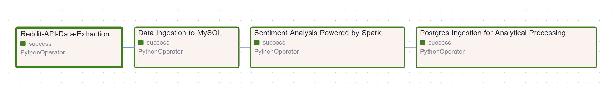

**🚀 End-to-End Reddit Sentiment Pipeline with Airflow & PySpark**
=====================================

**📋 Project Overview**
------------

This project demonstrates an end-to-end ETL (Extract, Transform, Load) pipeline for analyzing sentiment on Reddit posts. Using Apache Airflow, we automate the process of extracting data from multiple subreddits, transforming it with PySpark for sentiment analysis (using VADER), and loading the results into MySQL and PostgreSQL databases. Finally, we visualize the sentiment trends with an interactive Power BI dashboard.


**🛠️ Technologies Used**
---------------------------
- Apache Airflow: 🌀 Orchestrating the workflow and scheduling ETL jobs.
- PySpark: 💥 For distributed data transformation and sentiment analysis.
- MySQL: 🗄️ Storing raw data from Reddit.
- PostgreSQL: 📊 Storing transformed data for analytics.
- Reddit API: 🔍 For fetching posts from selected subreddits.
- VADER Sentiment Analysis: 🎭 Analyzing the sentiment of posts.
- Power BI: 📈 Creating visualizations to uncover sentiment insights.
- Docker: 🐳 Containerizing the Airflow environment ***(Yet to be implemented)***.

**📐 Architecture Diagram**
----------------------------------


**✨ Features**
----------------------------------
- **Automated ETL Pipeline :-** Powered by Airflow to automate and schedule data extraction, transformation, and loading.
- **Sentiment Analysis :-** Provides insights into the sentiment of Reddit posts (Positive, Neutral, or Negative).
- **MySQL & PostgreSQL :-** Data storage for both raw and transformed data.
- **Interactive Dashboard :-** Visualize the sentiment results and trends on Power BI.
- **Error Handling & Retries :-** Built-in retry mechanisms with logging via Airflow.
- **Daily Scheduling :-** Pipeline runs daily to fetch and analyze new Reddit posts.

**📁 Project Structure**
------------------------------------

```python
├── dags/
│   ├── reddit_dag.py  			        # Airflow DAG script
├── utils/
│   ├── downloadPosts.py                # Script to extract Reddit posts and save as Parquet
│   ├── dataLoad.py                     # Load data into MySQL and PostgreSQL
│   ├── transformData.py                # PySpark script for sentiment analysis
├── PowerBI/
│   ├── powerbi_dashboard.pbix          # Power BI Dashboard file
├── README.md                           # Project documentation
├── requirements.txt                    # Python dependencies
├── .env                                # Environment variables for Reddit API, MySQL, PostgreSQL
```

**💻 Installation and Setup**
----------------------------------
Step 1 - Clone the repository:
```bash
git clone https://github.com/yourusername/reddit-sentiment-analysis.git
```
Step 2 - Set up a virtual environment:
```bash
python3 -m venv venv
source venv/bin/activate  # For Linux/MacOS
venv\Scripts\activate     # For Windows
```
Step 3 - Install dependencies:
```bash
pip install -r requirements.txt
```
Step 4 - Configure environment variables: 
Create a .env file with the necessary credentials for Reddit API, MySQL, and PostgreSQL:
```bash
REDDIT_CLIENT_ID=your_reddit_client_id
REDDIT_CLIENT_SECRET=your_reddit_client_secret
REDDIT_USER_AGENT=your_reddit_user_agent
MYSQL_HOSTNAME=localhost
MYSQL_DATABASE=mysql_db
MYSQL_USERNAME=mysql_username
MYSQL_PASSWORD=mysql_password
POSTGRES_HOSTNAME=localhost
POSTGRES_DATABASE=postgres_db
POSTGRES_USERNAME=postgres_username
POSTGRES_PASSWORD=postgres_password
STAGING_AREA=/path/to/staging 			# Where you want to store the staging data
```
Step 5: Start Airflow: Initialize Airflow and copy the DAG to the Airflow DAGs folder:
```bash
airflow db init
mkdir -p ~/airflow/dags
cp dags/reddit_sentiment_dag.py ~/airflow/dags/
airflow webserver & airflow scheduler
```
**🏃 Running the Project**
-------------------------------------
1. **Launch Airflow :-** Once Airflow is running, navigate to the Airflow UI (http://localhost:8080).
2. **Enable and Trigger DAG :-** Toggle the switch to enable the SentimentAnalysis-Reddit DAG. You can trigger it manually or wait for the scheduled run.
3. **Monitor the Pipeline :-** Track the status, logs, and retries directly from the Airflow UI.
4. **View Results in Power BI :-** Open powerbi_dashboard.pbix in Power BI to explore sentiment trends (It is just for example puspose I have shared. You can make your own).

**🔄 ETL Workflow Details**
-------------------------------------


### Extract: 
- Reddit posts are fetched from subreddits such as `data`, `python`, `dataengineering`, and `career`. These can be modified in the DAG file to monitor other subreddits:
```python
# Change the subreddit names to explore different topics as per your interest
subRedditList = ['python', 'data', 'dataengineering', 'career']
```

### Raw Data Ingestion:
- MySQL: Stores raw Reddit posts data.

### Transform: 
-------------------------------------
- PySpark applies sentiment analysis using the VADER Sentiment. It scores the sentiment of each post and then categorizing them into Positive, Neutral, or Negative.

### Load:
-------------------------------------
- PostgreSQL: Stores sentiment analysis results for analytical processing.

**📊 Power BI Dashboard**
-------------------------------------
The Power BI dashboard can be used provides the following insights: (Try using it by making your own Dashboard by connecting it with Postgres DB in which you have stored the transformed data)

- Sentiment Distribution: Visualize the percentage of Positive, Neutral, and Negative posts.
- Sentiment Over Time: Track how sentiment evolves across subreddits.
- Top Posts: Explore the most popular posts based on sentiment.

**🛠️ Troubleshooting**
-------------------------------------
#### Airflow UI not starting: 
- Ensure port 8080 is available and no other services are running on that port. Try `airflow db reset` and restart the services.
- Database Connection Issues: Double-check that the credentials in the `.env` file match your database setup.

**👀 Keep an eye out for upcoming updates!!**
-------------------------------------
- Containerization of app using dokcer-compose
- Deployed Version of the app on AWS

**🤝 Contributing**
-------------------------------------
Feel free to fork this repository, create new features, or fix issues. Pull requests are always welcome! 🙌

**📬 Contact**
-------------------------------------
- Author : **Rohit Kumar**
- Email : [r.kumar01@hotmail.com](mailto:r.kumar01@hotmail.com)
- GitHub : [github.com/Analyst-Ninja/](https://github.com/Analyst-Ninja/)
- LinkedIn : [linkedin.com/in/analyst-ninja/](https://www.linkedin.com/in/analyst-ninja/)